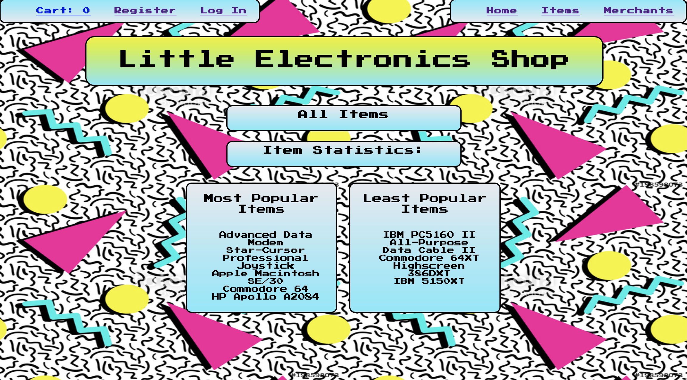
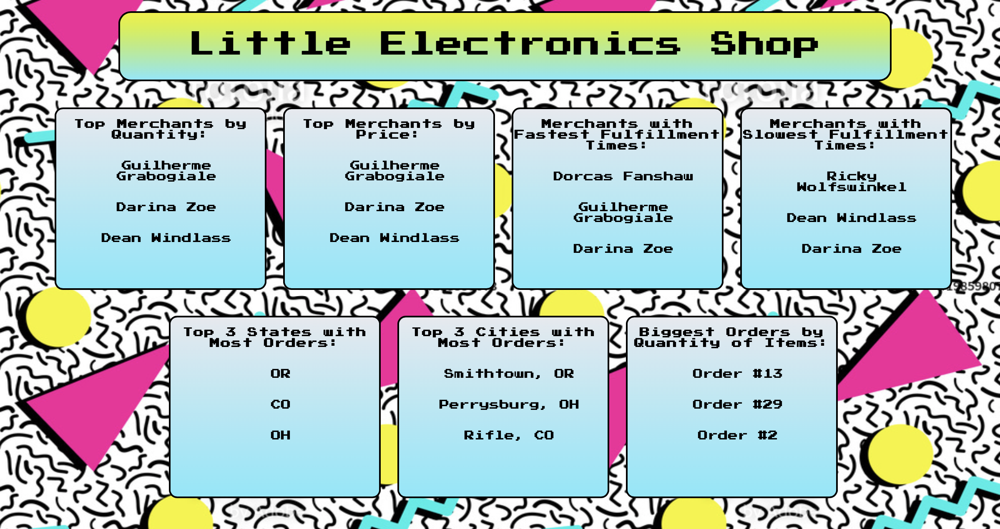
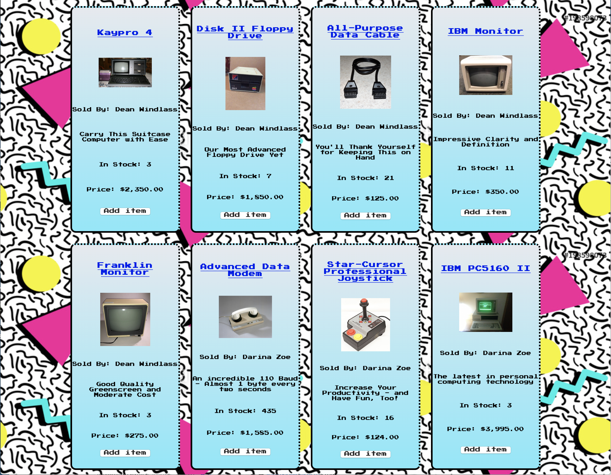
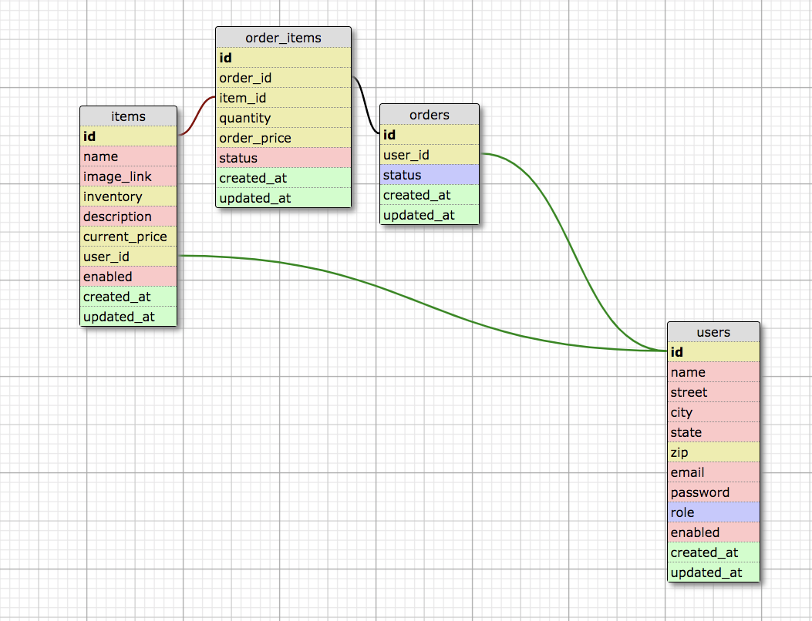

# Little Shop of Electronics

## Introduction

Little Electronics Shop is a web application that manages an online electronics store. This store represents multiple merchants, who individually fulfill separate items in aggregate orders that users place with the store. It was created as a group project in Module 2 of the backend program of the Turing School of Software Design. Project requirements can be found at https://github.com/turingschool-projects/little_shop_v2

## Features

-Casual unregistered users can come to the site and begin shopping right away, with no need to login. Any visitor to the site - whether registered or unregistered - can view all items for sale and see a listing of merchants and merchant staistics.

-After filling their carts, unregistered users can go through a simple registration process to become registered users and place their orders.

-Registered users can login to the site, edit their profile data, view their order histories, cancel unfulfilled orders, and place additional orders.

-In addition to default regular users, the site contains two additional levels of authorization: merchants and administrators. These authorizations are created with distinct namespaces for maximum data security.

-Merchant users on the site have their own dashboard pages, from which they can view and manage items and orders. They can also see statistics regarding their past sales and customers.

-Admin Users on the site can perform any function that any other user on the site can perform, and can perform those functions on behalf of other users. In addition, Admin users can upgrade default users to Merchants, or downgrade Merchants to default users. Admin users also have a special page with overall site statistics.

-The Little Electronics Shop site also features a fabulous 1980's-style design

## Site Hosting

The site is hosted on Heroku. To view the site, simply visit https://ancient-bastion-79326.herokuapp.com/

## The Database

The schema for the database contains four tables. "Users" is a general table of users, who can be either default users (customers), merchants, or administrators. Items are stored in an item table, with references to the merchants selling those items. Orders have a table of their own, and refer to the user that has placed the order. Orders and items are connected through a join table called order_items, which in addition to joining these two objects, stored the number of items ordered, and the price at which they were ordered.

## Installation

For those wishing to set up and run the project for themselves, Little Electronics Shop can be cloned from a public github repository at https://github.com/asmolentzov/little-shop, and requires rails 5.1.  After cloning the project, do the following on the command line in the project directory:

-Run 'bundle install' to install the required gems

-Instantiate the database by running 'rake db:{drop,create,migrate,seed}'.

-Run 'rails s' to run the project on localhost.

#### Testing

Rspec and Capybara are used in testing the site. The development of the site has been fully test-driven, and 100% of the code is covered by appropriate model and feature tests. To run the test suite type 'rspec' on the command line.

## Built With

Little Electronics Shop was built using Ruby/Rails version 5.1.6.1 and PostgreSQL for the application and database. The bcrypt gem was used for password security, and factorybot was used extensively in testing. The team creating the project worked almost entirely remotely, and relied extensively on Waffle.io as a project management tool.

## Authors

The project was created by Anna Smolentzov, Bradley Niedt, Dan Briechle, and William Petty
